# Email Contacts Manager

A RESTful API for managing contacts and emails, built with Spring Boot. 
This project provides a complete backend solution with authentication, 
contact management, and email messaging features.

**Note:** Messages are exchanged exclusively between registered plataform users, without external SMTP integration.

## Tech Stack

- Java 17
- Spring Boot
- Spring Security + JWT
- PostgreSQL
- Redis 
- Docker & Docker Compose 
- Maven
- JUnit 5 + Mockito
- GitHub Actions (CI)


## Features

- User Authentication: Register, login, and logout with JWT-based authentication
  
- User Profile: Update email, password, backup email, and online/offline status
  
- Contact Management: Add, list, search, and remove contacts from your address book
  
- Email Messaging: Send emails, view inbox, sent messages, and conversation history
  
- Secure & Validated: Password encryption (BCrypt), input validation, and duplicate prevention
  
- Persistent Token Blacklist: Logout invalidates tokens via Redis, surviving applicatio


## API Endpoints

### Auth

- `POST /auth/register` - Create account
- `POST /auth/login` - Login
- `POST /auth/logout` - Logout
- `POST /auth/forgot-password` - Request password reset code
- `POST /auth/verify-code` - Verify the 6-digit code
- `POST /auth/reset-password` - Reset password with code

### User Profile

- `PUT /User/email` - Update email
- `PUT /User/password` - Update password
- `POST /User/backup-email` - Add backup email
- `DELETE /User/backup-email` - Remove backup email
- `PUT /User/status` - Set online/offline

### Contacts

- `POST /contacts` - Add contact
- `GET /contacts` - List contacts
- `GET /contacts/search?q=` - Search by nickname
- `DELETE /contacts/{id}` - Remove contact

### Emails

- `POST /emails/send` - Send email
- `GET /emails/feed` - Inbox
- `GET /emails/sent` - Sent emails
- `GET /emails/feed/contact/{id}` - Inbox from a contact
- `GET /emails/sent/contact/{id}` - Sent to a contact
- `GET /emails/conversation/{id}` - Conversation with a contact
- `GET /emails/{id}` – Email details


### Prerequisites

- Java 17
- PostgreSQL 12+
- Redis 7+
- Docker & Docker Compose (optional)


## Setup

### Option 1 - Docker Compose

1. Clone the repo
2. Copy the environment template and set your own database credentials: bash => `cp .env.example .env`
3. Run: bash => `docker compose up`

The API will be available at `http://localhost:8080`


### Option 2 - Manual setup

1. Clone the repo
2. Create a PostgreSQL database named `email_manager`
3. Start a local Redis instance (or run `docker compose up -d redis`)
4. Copy the properties template and fill in your credentials: bash => `cp src/main/resources/application.properties.template src/main/resources/application.properties`
5. Run: bash => `./mvnw spring-boot:run`

The API will be available at `http://localhost:8080`.


## Running Test

bash => `./mvnw test`


### API Documentation

This project uses **Swagger/OpenAPI** for interactive API documentation.

### Swagger UI

Once the application is running, you can explore and test all endpoints at: 

- http://localhost:8080/swagger-ui/index.html


### OpenAPI JSON

You can also access the raw OpenAPI specification in JSON format: 

- http://localhost:8080/v3/api-docs


### How to test protected endpoints

1. Use `/auth/login` or `/auth/register` to get a JWT token
2. Click the --> Authorize <-- button 🔓 at the top of the Swagger page
3. Paste your token in the format: `Bearer your-token`
4. After that, for each protected endpoint, make sure to include the same token in the `Authorization`
header manually (Swagger does not always send it automatically)


## 📸 Screenshots

### Swagger UI - All Endpoints
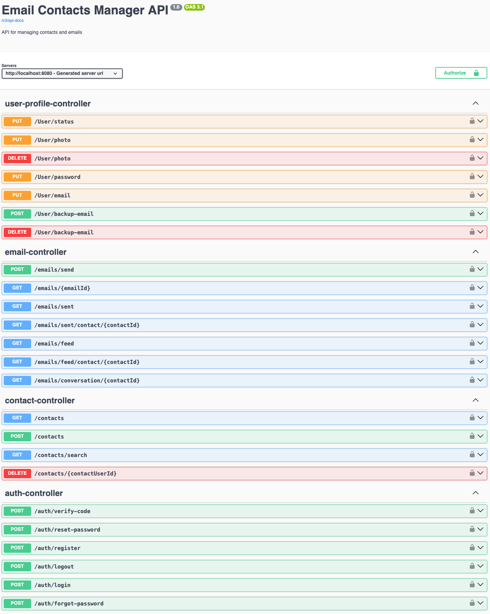

### Register
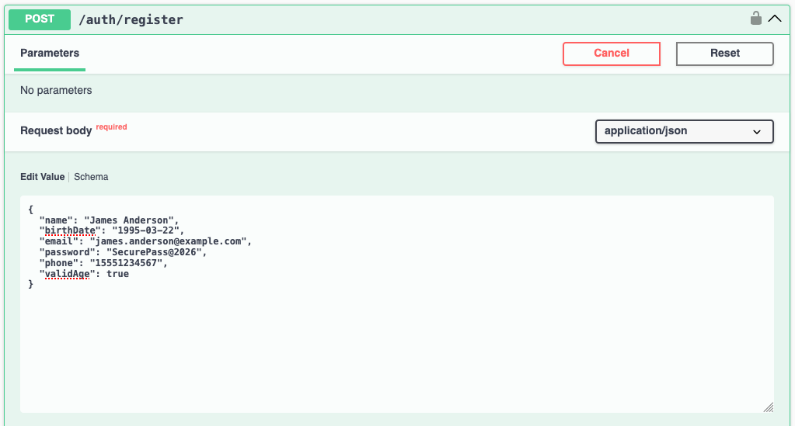
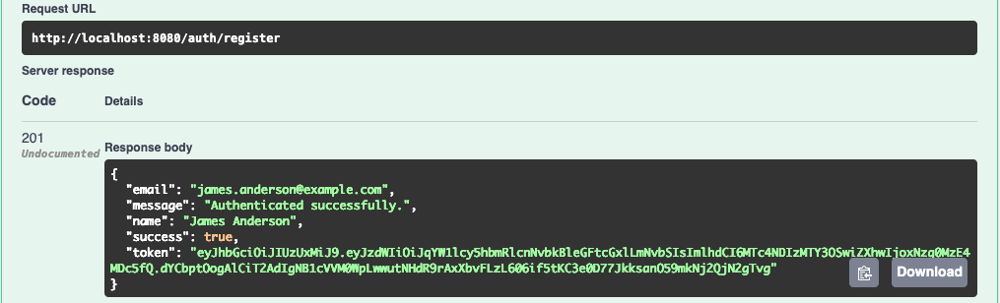

### Login & Token Authorization
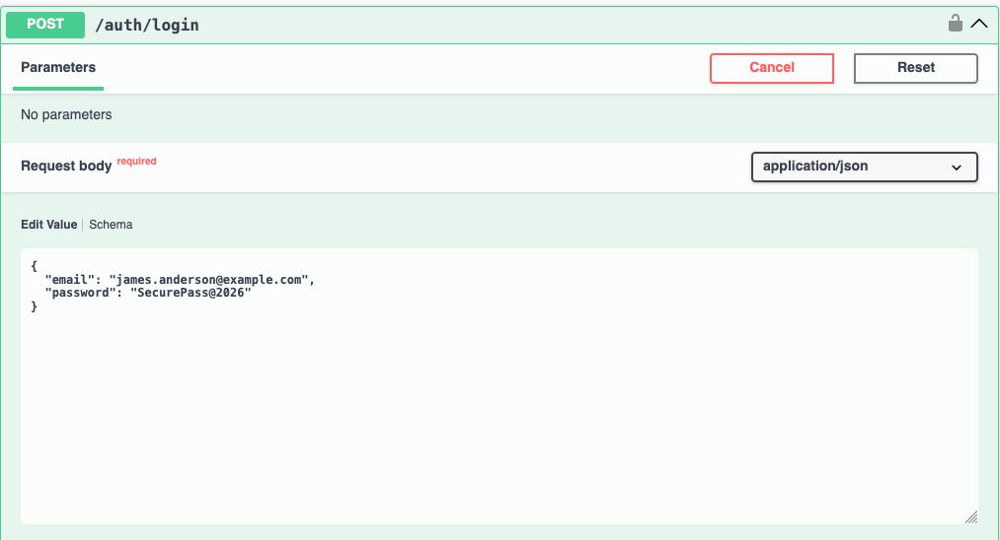

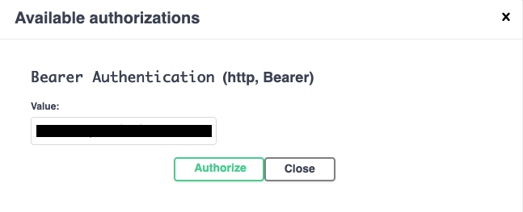


### Contacts

**Add Contact**
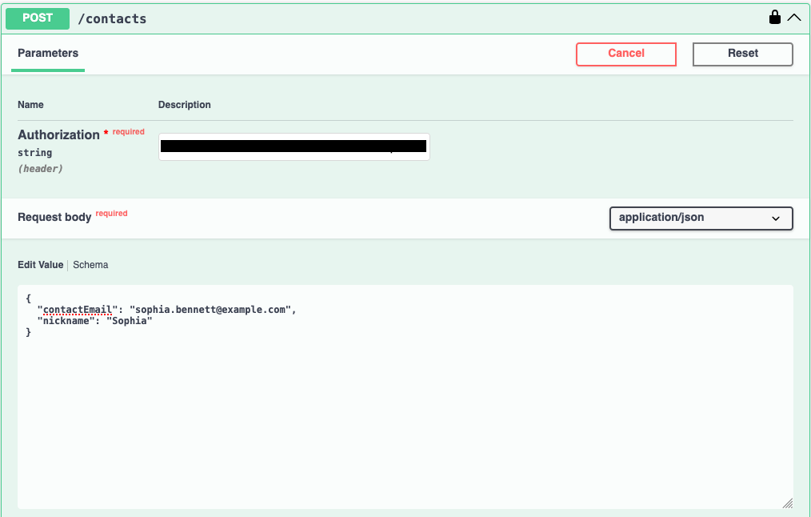
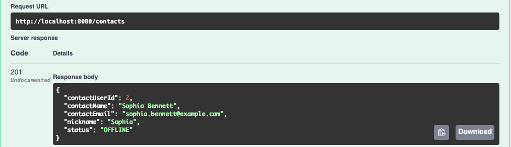

**List Contacts**
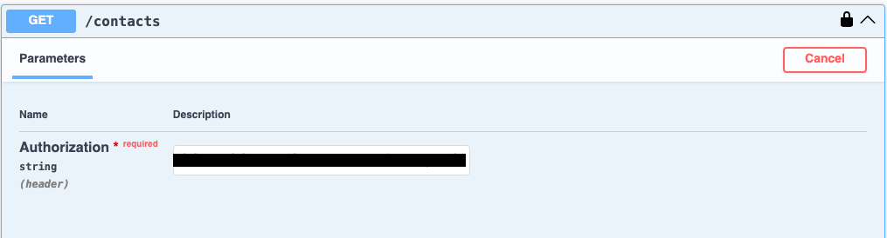
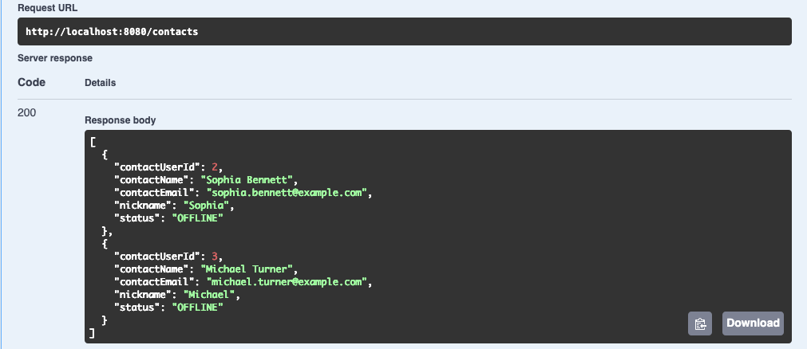

**Search Contact**
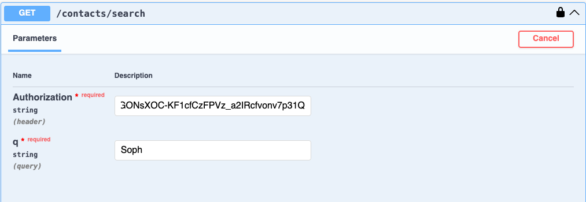
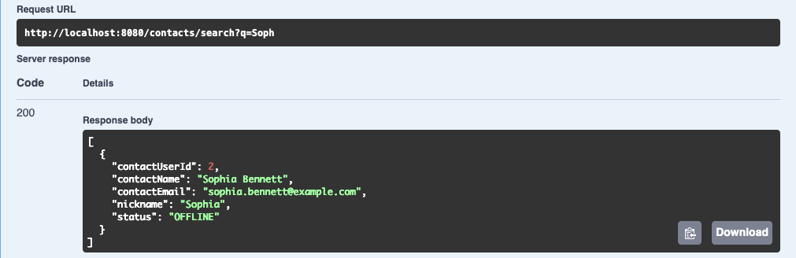

### Emails

**Send Email**
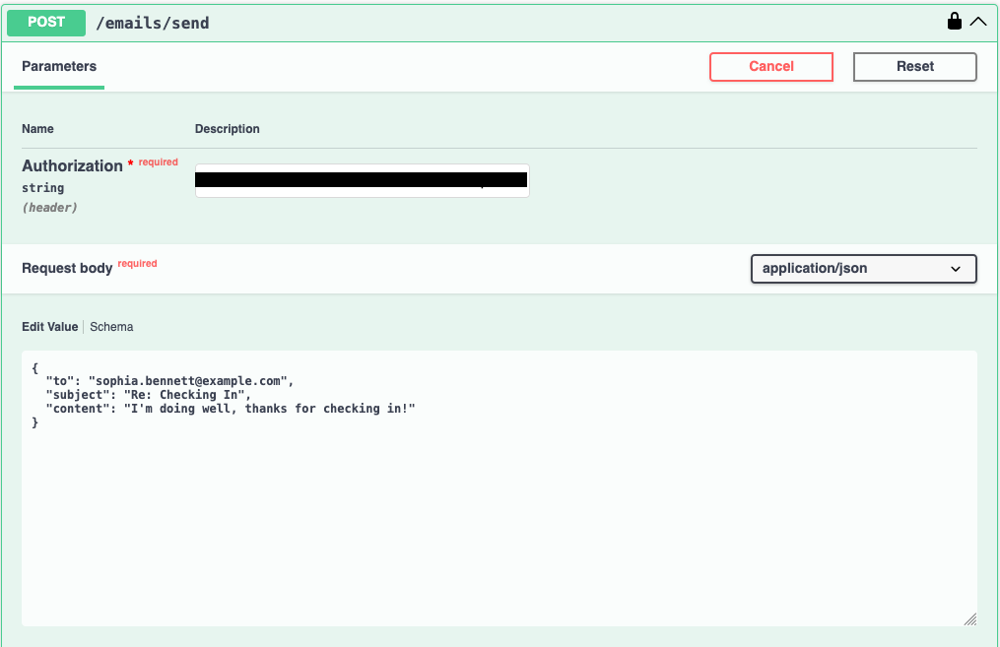
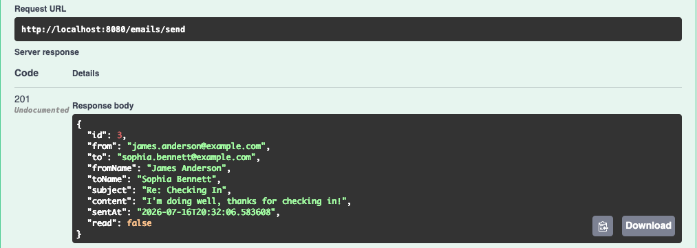

**Sent Emails**
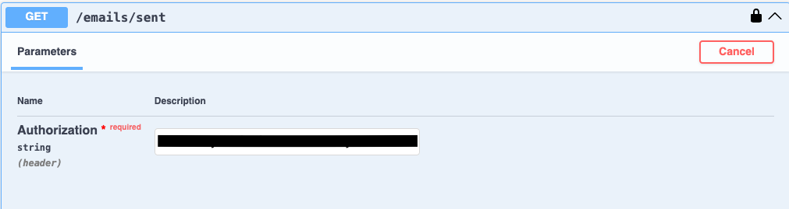
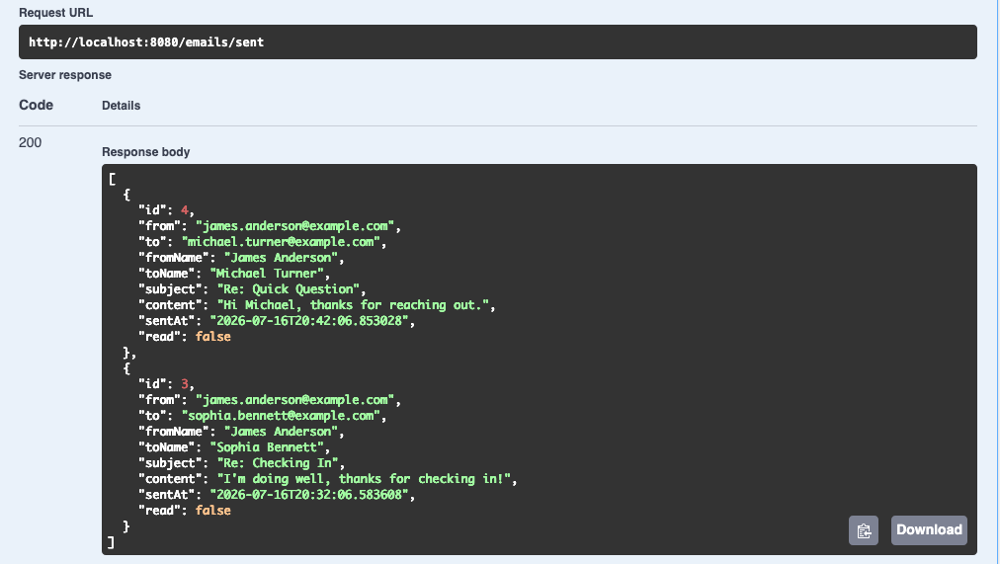

**Feed (Inbox)**
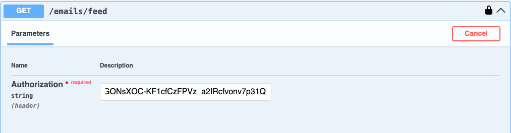
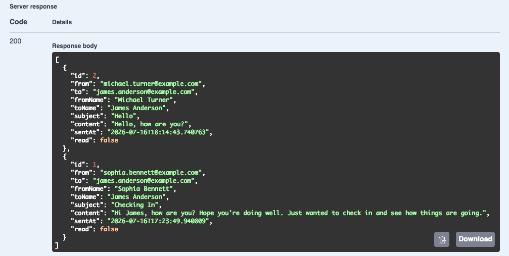

**Conversation with a Contact**
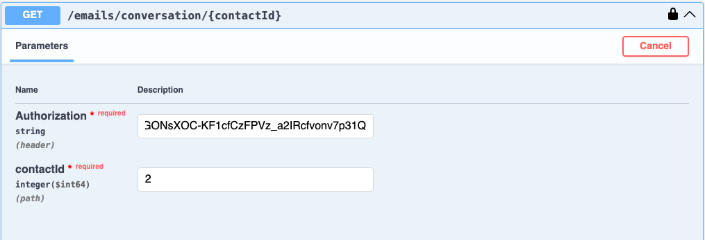
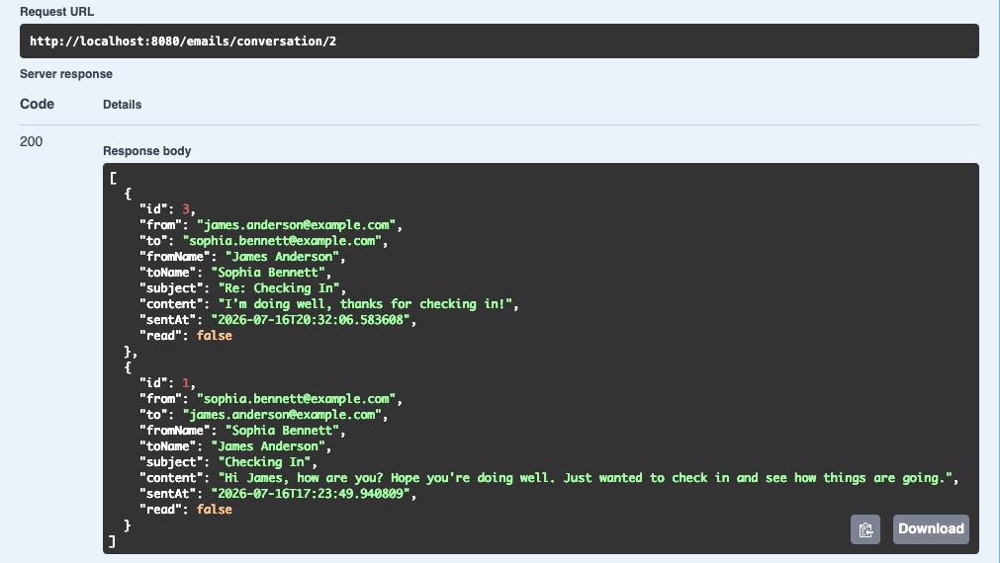


## Test Commands

### 🔑 Using variables in test commands     
                                                
To avoid copying the token manually every time, 
you can store it in a variable:

`bash`
-> YOUR_TOKEN="your_jwt_token_here"

-H "Authorization: Bearer $YOUR_TOKEN"


### Auth

### Register
curl -X POST http://localhost:8080/auth/register \
  -H "Content-Type: application/json" \
  -d '{"name":"John Doe","birthDate":"1990-05-15","email":"john@email.com","password":"Senha123!@#"}'

### Login
curl -X POST http://localhost:8080/auth/login \
  -H "Content-Type: application/json" \
  -d '{"email":"john@email.com","password":"Senha123!@#"}'

### Logout
curl -X POST http://localhost:8080/auth/logout \
  -H "Authorization: Bearer YOUR_TOKEN"

### Forgot Password

curl -X POST http://localhost:8080/auth/forgot-password 
  -H "Content-Type: application/json" 
  -d '{"email":"john@email.com","method":"sms"}'

### Verify Code

curl -X POST http://localhost:8080/auth/verify-code 
  -H "Content-Type: application/json" 
  -d '{"email":"john@email.com","code":"123456"}'

### Reset Password

curl -X POST http://localhost:8080/auth/reset-password 
  -H "Content-Type: application/json" 
  -d '{"email":"john@email.com","code":"123456","newPassword":"Senha123!@#"}'

```
### USER PROFILE
```
### Update email
curl -X PUT http://localhost:8080/User/email \
  -H "Content-Type: application/json" \
  -H "Authorization: Bearer YOUR_TOKEN" \
  -d '{"newEmail":"john.new@email.com"}'

### Add backup email
curl -X POST http://localhost:8080/User/backup-email \
  -H "Content-Type: application/json" \
  -H "Authorization: Bearer YOUR_TOKEN" \
  -d '{"backupEmail":"backup@email.com"}'

### Update status
curl -X PUT http://localhost:8080/User/status \
  -H "Content-Type: application/json" \
  -H "Authorization: Bearer YOUR_TOKEN" \
  -d '{"status":"OFFLINE"}'

```
### CONTACTS
```
### Add contact
curl -X POST http://localhost:8080/contacts \
  -H "Content-Type: application/json" \
  -H "Authorization: Bearer YOUR_TOKEN" \
  -d '{"contactEmail":"maria@email.com","nickname":"Maria"}'

### List contacts
curl -X GET http://localhost:8080/contacts \
  -H "Authorization: Bearer YOUR_TOKEN"

### Search contact
curl -X GET http://localhost:8080/contacts/search?q=Mar \
  -H "Authorization: Bearer YOUR_TOKEN"

### Remove contact
curl -X DELETE http://localhost:8080/contacts/2 \
  -H "Authorization: Bearer YOUR_TOKEN"

```
### EMAILS
```
### Send email
curl -X POST http://localhost:8080/emails/send \
  -H "Content-Type: application/json" \
  -H "Authorization: Bearer YOUR_TOKEN" \
  -d '{"to":"maria@email.com","subject":"Hello","content":"How are you?"}'

### Inbox
curl -X GET http://localhost:8080/emails/feed \
  -H "Authorization: Bearer YOUR_TOKEN"

### Sent
curl -X GET http://localhost:8080/emails/sent \
  -H "Authorization: Bearer YOUR_TOKEN"

### Inbox from a contact
curl -X GET http://localhost:8080/emails/feed/contact/2 \
  -H "Authorization: Bearer YOUR_TOKEN"

### Sent to a contact
curl -X GET http://localhost:8080/emails/sent/contact/2 \
  -H "Authorization: Bearer YOUR_TOKEN"

### Conversation
curl -X GET http://localhost:8080/emails/conversation/2 \
  -H "Authorization: Bearer YOUR_TOKEN"

### Email details
curl -X GET http://localhost:8080/emails/1 \
  -H "Authorization: Bearer YOUR_TOKEN"
```

### Author

Micael Tech – [GitHub](https://github.com/micaeltech)

